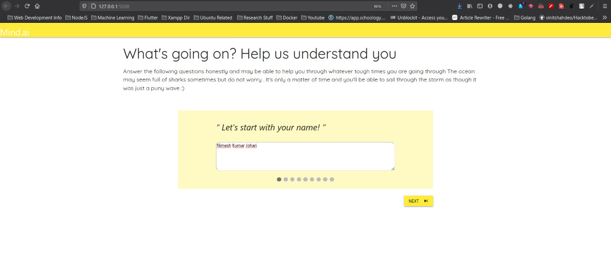
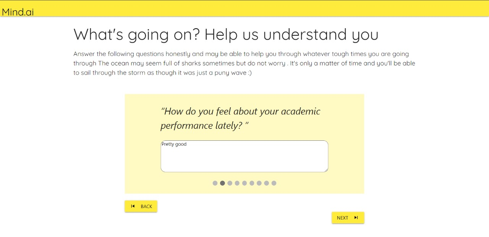
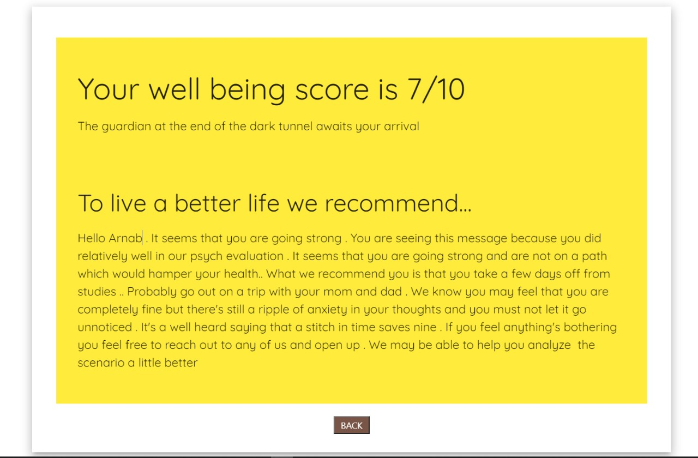

# VITHack2020

This Is a Project For the VIT Hack 2020 presenting to You mind AI 

A comprehensive sentiment analysis questionnaire. 

# Stack Used 

Front-end->CSS , Materialize CSS

Back-end->Flask

ML-> Tensor-Flow , NLTK

# ScreenShots

